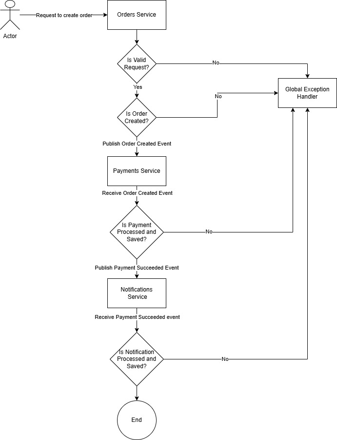

# dotnet-microservices-takehome-marcus

An order processing system with event driven architecture.

## How to Run the Service Locally

### Prerequisites
  - .NET 8+

### Steps

  - Navigate to `OrderProcessingSystem\OrderProcessor`
  - Run `dotnet build` command
  - Run `dotnet run` command
    - Application should be up and running on `http://localhost:5207`
    - Access Swagger UI on browser using `http://localhost:5207/swagger/index.html`
  - To start the event flow start create order using `api/orders`. Can use the below example Curl in CMD or Example request body in swagger UI.
  
    *Curl:*

    ```sh
    curl -X 'POST' \
    'http://localhost:5207/api/orders' \
    -H 'accept: text/plain' \
    -H 'Content-Type: application/json' \
    -d '{
    "amount": 49.09,
    "customerEmail": "sample@gmail.com"
    }'
    ```
    *Swagger UI:*

    POST `api/orders`

    Example Request Body:
    ```json
    {
      "amount": 49.09,
      "customerEmail": "sample@gmail.com"
    }
    ```
  - Can observe the logs to see the Event Flow.

### Run Tests

Navigate to `.\OrderProcessingSystem` and then run `dotnet test` command

### All available endpoints

  - POST api/orders          : Create new order
  - GET api/orders           : Get all created orders
  - GET api/orders/{orderId} : Get order by order ID
  - GET api/payments         : Get all processed payments
  - GET api/notifications    : Get all notifications

## Architecture Overview

  - Three Independent microservices with clear separation on endpoint, application, domain and infrastructure using layered architecture to cleanly separate each layer.
  - Services communicating only using Events via in memory event bus to reduce any dependency.
  - All three services have three different storages (EF In Memory DBs) to separate the data storages as well and follow `Repository Pattern`. 

## Event Flow Description

Event flow is as described below in the diagram.



As shown in the diagram

  - Orders service will receive order creation from a client and then validate the request and proceed to publish the `Order Created Event` with Order ID and other data.
  - Payments service will receive `Order Created Event` through the event bus and then proceed to process and then save the processed payment with Payment ID and order data. If all goes well proceed to publish the `Payment Succeeded Event` with Payment ID and other order related data.
  - Notification service will receive `Payment Succeeded Event` through the event bus and then proceed to process and then save the notification with Notification ID and Payment Data.

## Design Decisions and Assumptions
  - Went with layered architecture instead of vertical slicing to keep it simple with slices.
  - Used EF Inmemory DB for easiness and cleanlyness of implementation and to keep the future extendability in mind.
  - All three modules (OrdersService, PaymentsService, and NotificationsService) are structured in a way to self contain all they need within the layered architecture.

## Any known limitations and future improvements

  - Since using the in memory event bus didn't create three different microservices but only the structures and separation to mimic three different microservices. In the future create three microservices which can deploy independently.
  - No Tracing added for application flow as events can only track through Order ID, Payment ID or Notification ID. Maybe in the future add tracing and add observability.
  - In Memory Event Bus has no retriying machanism or better way to subscribe hence Implement to use RabbitMQ or Kafka instead of in memory event bus to handle events.
  - in the solution now we have used EF In Memory database but in future, a database can be used instead of in memory EF database.
